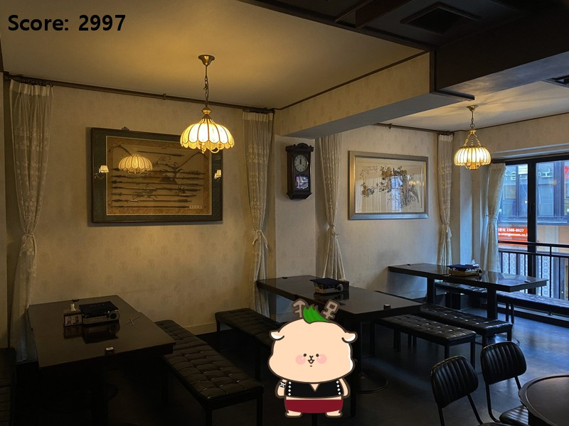
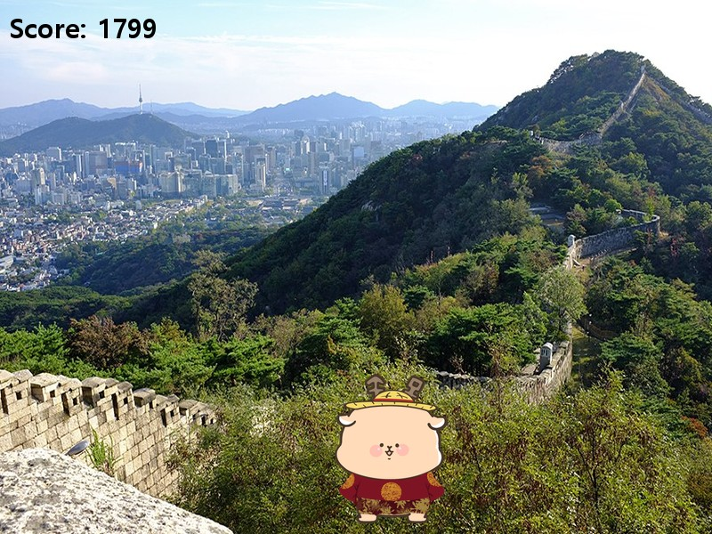
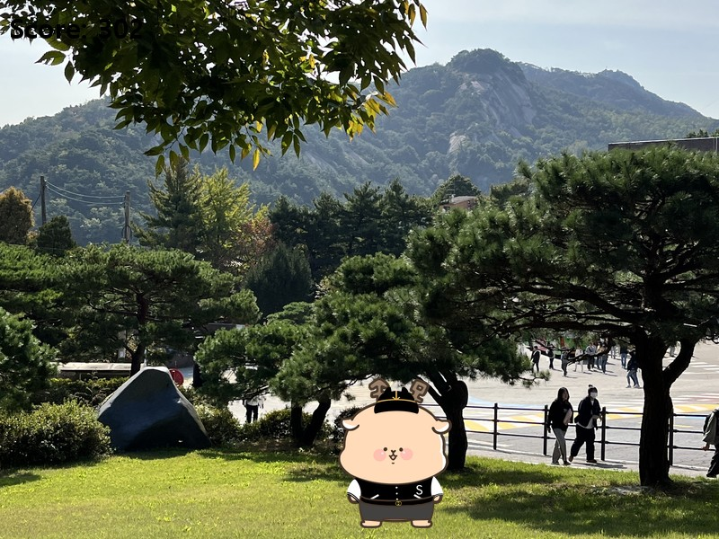

<h1 align="center">pygame-games</h1>

<p align="center">Python · pygame으로 만든 2D 게임</p>

<p align="center">
  
  
</p>

<p align="center">
  <a href="#-sumungs-look-book">Sumung's Look Book</a> ·
  <a href="#-snake">Snake</a> ·
  <a href="#실행">실행</a>
</p>

<br>

## 🧢 Sumung's Look Book

<p align="center">
  
  
  
</p>
<p align="center"><sub>같은 코디라도 일정이 어디냐에 따라 점수가 갈린다 — 종각 2997점 · 북악산 1799점 · 캠퍼스 302점</sub></p>

상명대 캐릭터 **수뭉이**의 하루 일정이 랜덤으로 정해지고, 그 일정에 어울리는 모자·상의·하의를 골라 점수를 얻는 게임.

### 하루 일정 4종

<p align="center">
  
</p>
<p align="center"><sub>종각 · 체부동 · 북악산 · 캠퍼스</sub></p>

### 흐름

| 키 | 일어나는 일 |
|---|---|
| `Space` | 기숙사에서 시작 |
| `S` | 오늘 일정 공개 — 네 곳 중 하나가 랜덤으로 |
| `S` | 모자 → 상의 → 하의 순으로 아이템이 자동 순환, 마음에 드는 순간 멈춘다 |
| — | 일정 장소를 배경으로 완성된 코디와 점수, 수뭉이의 반응이 뜬다 |

### 점수 설계

아이템마다 **일정별 점수표**를 갖는다. 등산 일정에 정장 모자를 고르면 1점, 등산 모자를 고르면 999점.

```python
hats = [
    {'image': hat1, 'scores': {0: 100, 1: 600, 2: 100, 3: 100}},
    {'image': hat2, 'scores': {0: 999, 1:   1, 2:   1, 3:   1}},
    ...
]
#                              └ 종각  └ 체부동 └ 북악산 └ 캠퍼스
```

세 아이템 합이 2000을 넘으면 좋은 반응, 1000을 넘으면 보통, 그 아래는 나쁜 반응.

### 구현에서 신경 쓴 것

- **상태 전환을 키 누른 횟수로 관리** — `s_key_count`로 단계를 세고, 키를 누르고 있는 동안 중복 입력되지 않도록 눌림 상태를 따로 추적한다
- **아이템 선택 로직 분리** — `choose_item()`이 목록·화면·일정 인덱스를 받아 선택된 아이템과 점수를 돌려준다. 모자·상의·하의가 같은 함수를 세 번 쓴다
- **이미지를 두 벌로 관리** — 고르는 화면용 썸네일(200×100)과 착용 화면용(400×400 이상)을 나눠, 캐릭터 위에 얹었을 때 비율이 맞게 했다

📄 [`lookbook/main.py`](lookbook/main.py)

<br>

## 🐍 Snake

400×400 격자에서 뱀을 움직여 사과를 먹으면 몸이 길어지고, 자기 몸에 부딪히면 종료.
조작은 방향키 `↑ ↓ ← →`.

### 구현에서 신경 쓴 것

- **`Snake` / `Apple` 클래스로 분리**, 위치는 `(row, col)` 튜플 리스트로 들고 있는다
- **이동은 머리 앞에 새 좌표를 붙이고 꼬리를 떼는 방식** — 전체를 옮기지 않아도 된다

  ```python
  self.positions = [(y - 1, x)] + self.positions[:-1]
  ```
- **프레임 속도와 이동 속도를 분리** — `clock.tick(10)`으로 화면을 갱신하되, 이동은 `datetime` 기준 0.1초 간격으로 따로 센다. 렌더링이 빨라져도 뱀이 빨라지지 않는다

📄 [`snake/main.py`](snake/main.py)

<br>

## 실행

```bash
pip install -r requirements.txt

python lookbook/main.py
python snake/main.py
```

Python 3.10+ · pygame 2.x

<br>

## 구조

```
pygame-games/
├─ lookbook/
│  ├─ main.py
│  └─ image/          배경 · 캐릭터 · 아이템 · 말풍선 47장
├─ snake/
│  └─ main.py
├─ docs/              README용 화면
└─ requirements.txt
```

<p align="center">
  <sub>위 화면은 게임의 렌더 순서·좌표를 그대로 써서 합성한 것이다.</sub>
</p>
